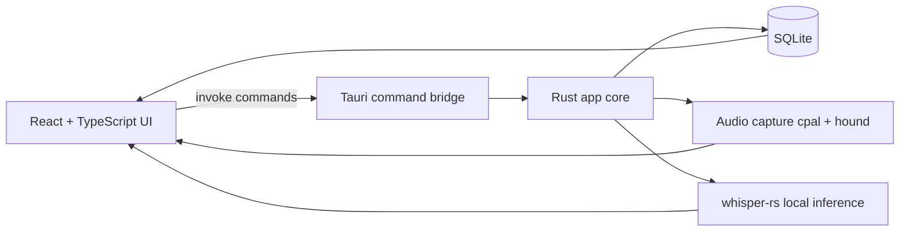

# Mumble

Local-first desktop meeting recorder and transcriber built with Tauri, React, Rust, and SQLite.

## Table of Contents

- [Product Overview](#product-overview)
- [Features](#features)
- [Architecture](#architecture)
- [Tech Stack](#tech-stack)
- [Getting Started](#getting-started)
- [Usage](#usage)
- [Build \& Distribution](#build--distribution)
- [Project Structure](#project-structure)
- [Troubleshooting](#troubleshooting)
- [License](#license)

## Product Overview

Mumble helps you capture spoken meetings locally, play them back, and transcribe them with a local Whisper GGML model file. No cloud transcription service is required.

## Features

- Local meeting management with SQLite
- Microphone recording per meeting (WAV)
- In-app playback for recorded audio
- Local Whisper transcription (`ggml-*.bin`)
- Per-app default model selection (transcription + summarization)
- Live speech-reactive recording visualizer
- Meeting cleanup controls:
  - Clear recording/transcript
  - Delete meeting
- Settings section for:
  - Default models
  - Whisper model file path
  - Light/Dark mode toggle
- Mondrian-inspired geometric UI + vinyl-inspired icon

## Architecture



### Runtime flow

1. User creates a meeting in the UI.
2. UI calls Rust command to start/stop recording.
3. Rust writes WAV files and meeting metadata to local storage.
4. UI requests transcription for a meeting.
5. Rust loads the local GGML model, runs Whisper inference, and stores transcript.
6. UI renders transcript and playback controls.

## Tech Stack

| Layer | Technology |
|---|---|
| Desktop shell | Tauri v2 |
| Frontend | React + TypeScript + Vite |
| Backend | Rust |
| Database | SQLite (`rusqlite`) |
| Audio capture | `cpal`, `hound` |
| Transcription | `whisper-rs` (local) |

## Getting Started

### Prerequisites

- macOS
- Node.js (LTS) + pnpm
- Rust toolchain (`rustup`)
- Xcode Command Line Tools

### Run locally

```bash
git clone <your-repo-url>
cd mumble
source "$HOME/.cargo/env"
pnpm install
pnpm tauri dev
```

## Usage

1. Open **Settings**.
2. Set **Whisper model file** (example: `~/Downloads/ggml-base.bin`).
3. Go to **Meetings**.
4. Create a meeting, record audio, stop recording, then transcribe.

### Example model download

```bash
curl -L https://huggingface.co/ggerganov/whisper.cpp/resolve/main/ggml-base.bin \
  -o ~/Downloads/ggml-base.bin
```

## Build & Distribution

### Build app bundles

```bash
source "$HOME/.cargo/env"
pnpm tauri build
```

Build artifacts:

```text
src-tauri/target/release/bundle/
```

For non-technical users, publish the generated `.dmg` in **GitHub Releases**.

## Project Structure

```text
mumble/
├─ src/                    # React UI
├─ src-tauri/
│  ├─ src/lib.rs           # Tauri commands + DB + audio + whisper logic
│  ├─ tauri.conf.json      # Tauri app configuration
│  └─ icons/               # App icons for bundle targets
├─ package.json
└─ README.md
```

## Troubleshooting

- If recording fails, ensure microphone permission is granted for Terminal/App.
- If transcription fails, verify the GGML model path exists and is readable.
- If macOS blocks app launch, right-click the app and choose **Open** once.
- If `pnpm tauri build` fails in native deps, refresh Xcode CLI tools and retry.

## Data Paths

- DB: `~/Library/Application Support/com.a1040811.mumble/mumble.db`
- Audio: `~/Library/Application Support/com.a1040811.mumble/meetings/<meeting_id>/audio.wav`

## License

Choose and add your preferred license file (for example MIT) before public release.
